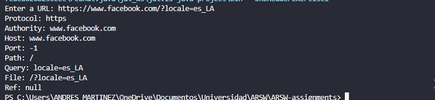

# Exercise 1

Escriba un programa en el cual usted cree un objeto URL e imprima en pantalla cada uno de los datos que retornan los 8 metodos: informacion de un objeto URL: getProtocol, getAuthority, getHost, getPort, getPath, getQuery,
getFile, getRef.

