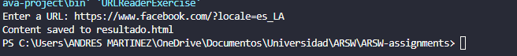
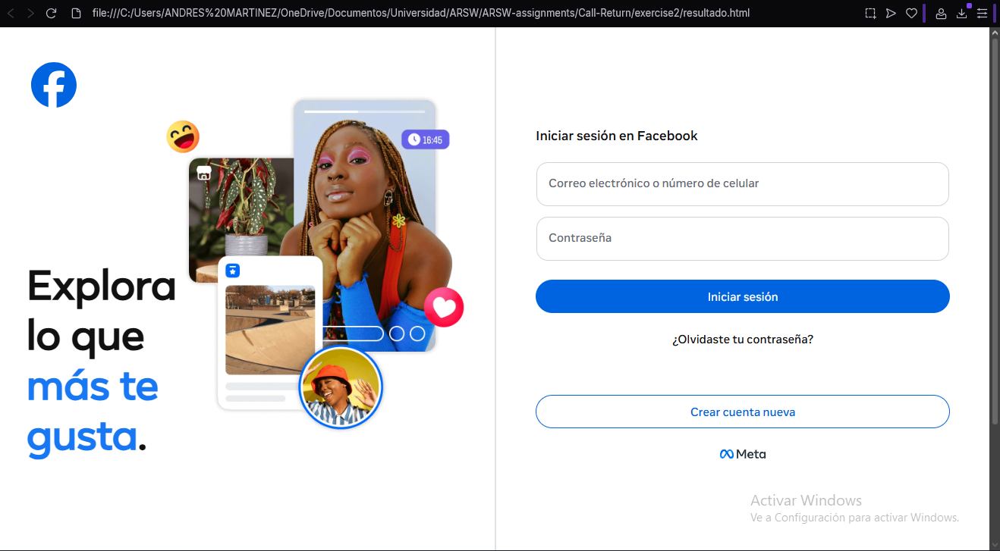

# Exercise 2

Escriba una aplicaci´on browser que pregunte una direcci´on URL al usuario y que lea datos de esa direcci´on y que los almacene en un archivo con el nombre resultado.html.
Luego intente ver este archivo en el navegador

Ejecutando: 

Resultado:

