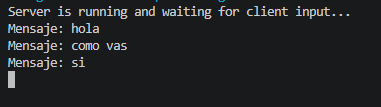
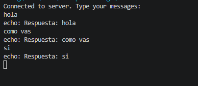
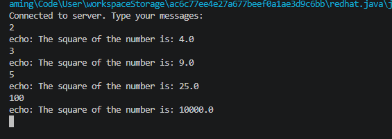
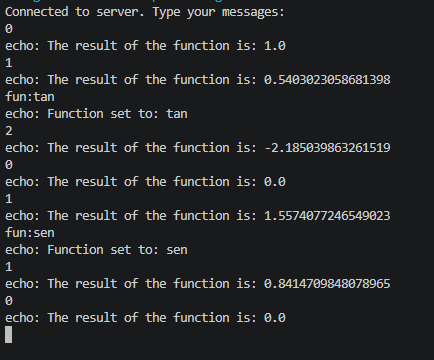
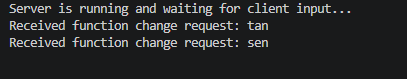

# Exercise 4.3
La siguiente parte consiste en implementar el servidor. El servidor escucha en un puerto y responde a las solicitudes de cada cliente.

1. Escriba un servidor que reciba un numero y responda el cuadrado de este numero.

Se implementó un servidor que recibe un número enviado por un cliente y responde con el cuadrado de dicho número. Para esto, el servidor se mantiene a la espera de una conexión, recibe mensajes en forma de texto, los convierte a valores numéricos y realiza la operación matemática correspondiente. En caso de que el valor recibido no sea un número válido, el servidor responde con un mensaje de error. Esta implementación permitió practicar el manejo básico de entrada y salida de datos en una conexión por sockets, así como el procesamiento de valores numéricos en el servidor.

2. Escriba un servidor que pueda recibir un número y responda con una operación sobre este número. Este servidor puede recibir un mensaje que empiece por “fun:”, si recibe este mensaje cambia la operación a la especificada. El servidor debe responder las funciones seno, coseno y tangente. Por defecto debe empezar calculando el coseno. Por ejemplo, si el primer número que recibe es 0, debe responder 1, si después recibe π/2 debe responder 0, si luego recibe “fun:sen” debe cambiar la operación actual a seno, es decir a partir de ese momento debe calcular senos. Si enseguida recibe 0 debe responder 0.

Se implementó un servidor más avanzado que permite cambiar dinámicamente la operación matemática que se aplica a los números recibidos. El servidor soporta las funciones seno, coseno y tangente, iniciando por defecto con la función coseno. A través de mensajes especiales que comienzan con el prefijo `"fun:"`, el cliente puede indicar un cambio de operación, lo que modifica el comportamiento del servidor en tiempo de ejecución sin necesidad de reiniciarlo.

Para esta implementación se utilizó el patrón de diseño Strategy, donde cada operación matemática se encapsula como un comportamiento intercambiable. De esta forma, el servidor mantiene una referencia a la operación activa y simplemente delega el cálculo a dicha estrategia. En una primera versión del ejercicio, las estrategias fueron implementadas mediante clases separadas para cada operación, lo que permitió comprender el patrón de manera más estructurada. Posteriormente, en la versión final, estas mismas estrategias se implementaron utilizando expresiones lambda, lo que permitió simplificar el código y reducir la necesidad de definir clases adicionales, manteniendo el mismo comportamiento pero con una implementación más compacta y funcional.

En conjunto, ambos ejercicios permitieron reforzar conceptos de programación de redes, manejo de streams en Java y aplicación de patrones de diseño para la construcción de software flexible.