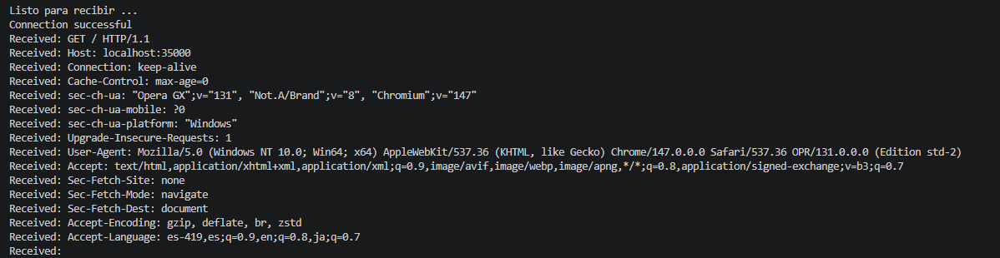
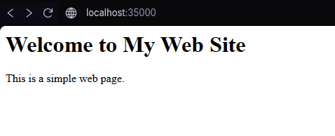
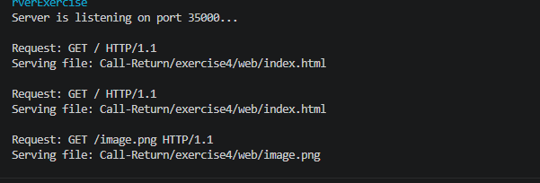

# Exercise 4.5

El codigo 4 presenta un servidor web que atiende una solicitud. Implemente el servidor e intente conectarse desde el browser.

En el link http://localhost:35000

Al realizar la conexión, el navegador envía una solicitud HTTP al servidor, el cual responde con una página HTML básica construida manualmente en el código.




1. Escriba un servidor web que soporte mu´ltiples solicitudes seguidas (no concurrentes). El servidor debe retornar todos los archivos solicitados, incluyendo p´aginas html e im´agenes.

En este ejercicio se implementó un servidor web en Java utilizando sockets, el cual es capaz de atender múltiples solicitudes de forma secuencial (no concurrente). El servidor permanece activo en un ciclo continuo esperando conexiones de clientes, en este caso un navegador web.

El servidor recibe las solicitudes HTTP realizadas por el navegador y extrae la ruta del recurso solicitado. Si la solicitud corresponde a la ruta raíz (`/`), el servidor responde con el archivo por defecto `index.html`. En caso contrario, intenta localizar y devolver el archivo solicitado dentro del directorio `web`.

El servidor es capaz de retornar diferentes tipos de archivos, incluyendo páginas HTML e imágenes (JPG y PNG). Para ello, identifica la extensión del archivo solicitado y asigna el tipo de contenido correspondiente mediante el encabezado `Content-Type`. Los archivos HTML se envían como texto, mientras que las imágenes y otros archivos binarios se envían en formato de bytes.

En caso de que el archivo no exista, el servidor responde con un mensaje de error `404 Not Found`.

### Pruebas del servidor

El servidor puede ser probado accediendo desde un navegador a la siguiente dirección:

```
http://localhost:35000
```

Si se accede a la ruta raíz, el servidor devuelve el archivo `index.html` por defecto.



También es posible solicitar archivos específicos, por ejemplo:

```
http://localhost:35000/image.png
```

En este caso, el servidor responde con la imagen almacenada en el directorio `web`.


### Evidencia de ejecución

Durante la ejecución del servidor se puede observar en consola cómo se reciben las solicitudes del navegador:

- Se imprime la línea de request HTTP enviada por el cliente.
- Se muestra la ruta del archivo que está siendo servido.

