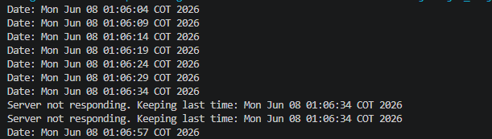

# Exercise 5.2

1. Utilizando Datagramas escriba un programa que se conecte a un servidor que responde la hora actual en el servidor. El programa debe actualizar la hora cada 5 segundos segu´n los datos del servidor. Si una hora no es recibida debe mantener la hora que ten´ıa. Para la prueba se apagar´a el servidor y despu´es de unos segundos se reactivar´a. El cliente debe seguir funcionando y actualizarse cuando el servidor este nuevamente funcionando.

En este ejercicio se implementó una aplicación cliente-servidor utilizando datagramas (UDP). El servidor permanece escuchando solicitudes de los clientes y, cada vez que recibe una petición, responde con la fecha y hora actual del sistema.

Por su parte, el cliente envía una solicitud al servidor cada 5 segundos con el fin de obtener la hora actual. Cuando recibe una respuesta válida, actualiza la hora mostrada en pantalla con la información enviada por el servidor.

Para cumplir con los requisitos del ejercicio, se implementó un mecanismo de tolerancia a fallos mediante un tiempo de espera (timeout). Si el cliente no recibe una respuesta dentro del tiempo establecido, asume que el servidor no está disponible y conserva la última hora recibida, continuando su ejecución sin finalizar el programa.

Durante las pruebas se verificó el comportamiento solicitado apagando el servidor mientras el cliente se encontraba en ejecución. En este escenario, el cliente continuó funcionando y mostró mensajes indicando que no se recibió una actualización, manteniendo la última hora conocida. Posteriormente, al reiniciar el servidor, el cliente volvió a recibir respuestas y actualizó nuevamente la hora de forma automática sin necesidad de reiniciar la aplicación.

