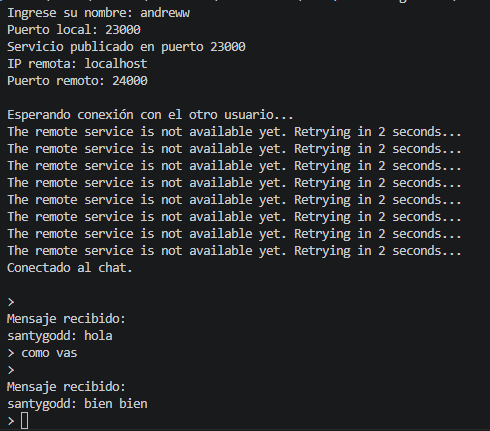
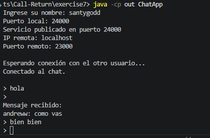

# Exercise 6

1. CHAT: Utilizando RMI, escriba un aplicativo que pueda conectarse a otro aplicativo del mismo tipo en un servidor remoto para comenzar un chat. El aplicativo debe solicitar una direcci´on IP y un puerto antes de conectarse con el cliente que se desea. Igualmente, debe solicitar un puerto antes de iniciar para que publique el objeto que recibe los llamados remotos en dicho puerto.


# Java RMI - Chat Distribuido

## Descripción

Este proyecto implementa una aplicación de chat distribuido utilizando Java RMI (Remote Method Invocation). Cada instancia del programa publica un servicio remoto para recibir mensajes y, simultáneamente, puede conectarse a otra instancia para enviar mensajes.

A diferencia del ejemplo Echo Server, donde existía una separación clara entre cliente y servidor, en este ejercicio cada participante actúa como:

- **Servidor**, al publicar un objeto remoto que recibe mensajes.
- **Cliente**, al conectarse al objeto remoto del otro participante para enviar mensajes.

---

## Conceptos de RMI utilizados

Java RMI permite invocar métodos de objetos ubicados en otra Máquina Virtual de Java (JVM), incluso si se encuentran en otro equipo conectado por red.

En este proyecto se utilizan los siguientes componentes:

### Interfaz remota

Define los métodos que pueden ser invocados remotamente.

```java
public interface ChatService extends Remote {
    void recibirMensaje(String mensaje) throws RemoteException;
}
```

### Objeto remoto

Implementa la lógica para recibir mensajes enviados desde otra instancia del chat.

### Registry

Cada aplicación crea y publica su propio registro RMI mediante:

```java
LocateRegistry.createRegistry(puertoLocal);
```

Posteriormente publica el servicio utilizando:

```java
registry.rebind("chat", localStub);
```

### Cliente RMI

Obtiene una referencia remota al servicio del otro usuario mediante:

```java
registry.lookup("chat");
````

Cada usuario publica un servicio y se conecta al servicio remoto del otro usuario.

---

## Estructura del proyecto

```text
exercise7/
│
├── README.md
│
├── src/
│   ├── ChatService.java
│   ├── ChatServiceImpl.java
│   └── ChatApp.java
│
└── out/
```

### Archivos principales

| Archivo | Descripción |
|----------|-------------|
| ChatService.java | Interfaz remota |
| ChatServiceImpl.java | Implementación del servicio de recepción de mensajes |
| ChatApp.java | Aplicación principal del chat |

---

## Requisitos

- Java JDK 21 o superior.
- Consola de comandos (PowerShell, CMD o Terminal).
- Conectividad de red entre los participantes (si se ejecuta en equipos diferentes).

---

## Compilación

Desde la carpeta raíz del proyecto:

```bash
javac -d out src\*.java
```

---

## Ejecución

Cada participante debe ejecutar:

```bash
java -cp out ChatApp
```

---

## Ejemplo de ejecución local

### Usuario A

```text
Ingrese su nombre: Andres
Puerto local: 23000
Servicio publicado en puerto 23000

IP remota: localhost
Puerto remoto: 24000
```

### Usuario B

```text
Ingrese su nombre: Felipe
Puerto local: 24000
Servicio publicado en puerto 24000

IP remota: localhost
Puerto remoto: 23000
```

---

### Ejemplo:





## Ejemplo de ejecución en red local

Supongamos dos equipos conectados a la misma red:

| Equipo | Dirección IP |
|----------|----------|
| Usuario A | 192.168.1.10 |
| Usuario B | 192.168.1.20 |

### Usuario A

```text
Ingrese su nombre: Andres
Puerto local: 23000

IP remota: 192.168.1.20
Puerto remoto: 24000
```

### Usuario B

```text
Ingrese su nombre: Felipe
Puerto local: 24000

IP remota: 192.168.1.10
Puerto remoto: 23000
```

Una vez ambos servicios estén publicados, la comunicación se realiza exactamente igual que en la ejecución local.

---

## Manejo de conexión

La aplicación implementa un mecanismo de reintento automático.

Si el usuario intenta conectarse antes de que el otro participante haya publicado su servicio, el programa no finaliza con una excepción. En su lugar, continúa intentando establecer la conexión cada dos segundos hasta que el servicio remoto esté disponible.

```text
Esperando conexión con el otro usuario...
El servicio remoto aún no está disponible. Reintentando en 2 segundos...
Conectado al chat.
```

Esto permite iniciar las aplicaciones en cualquier orden y simplifica las pruebas.

---
