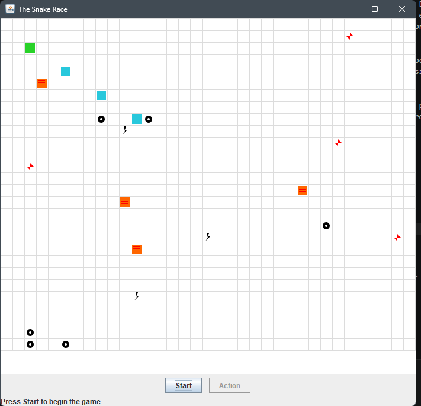
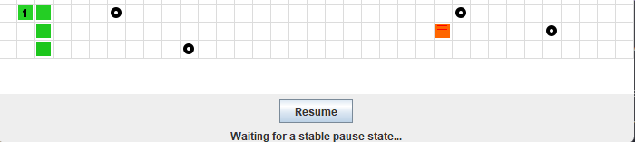
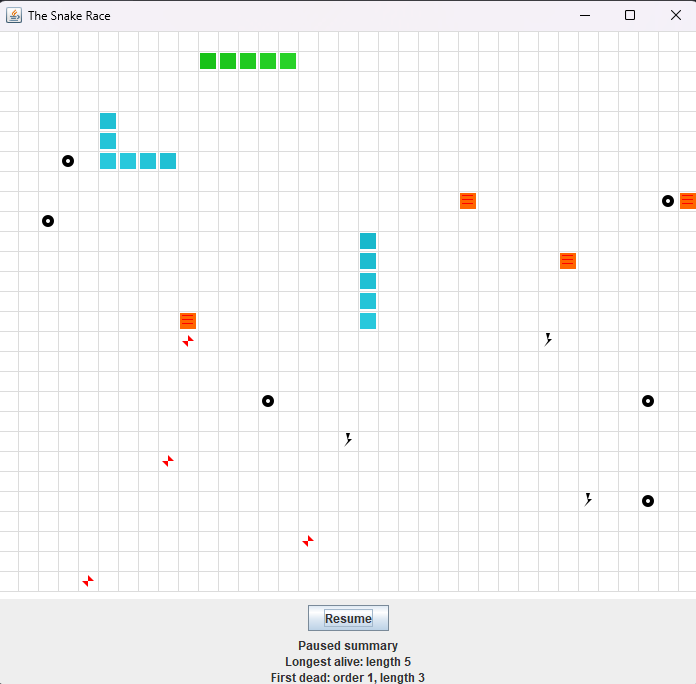
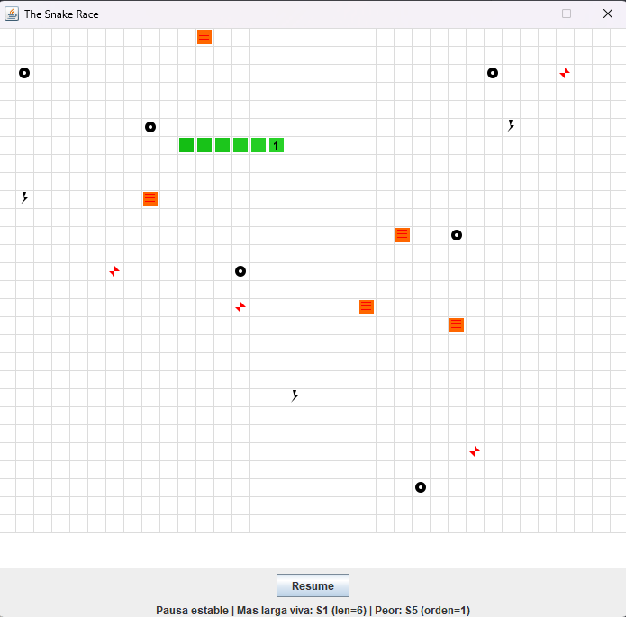
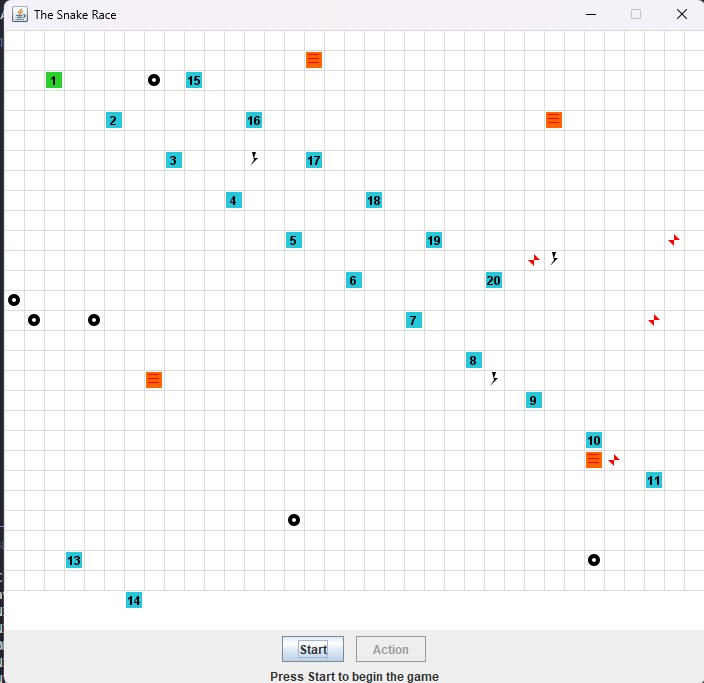
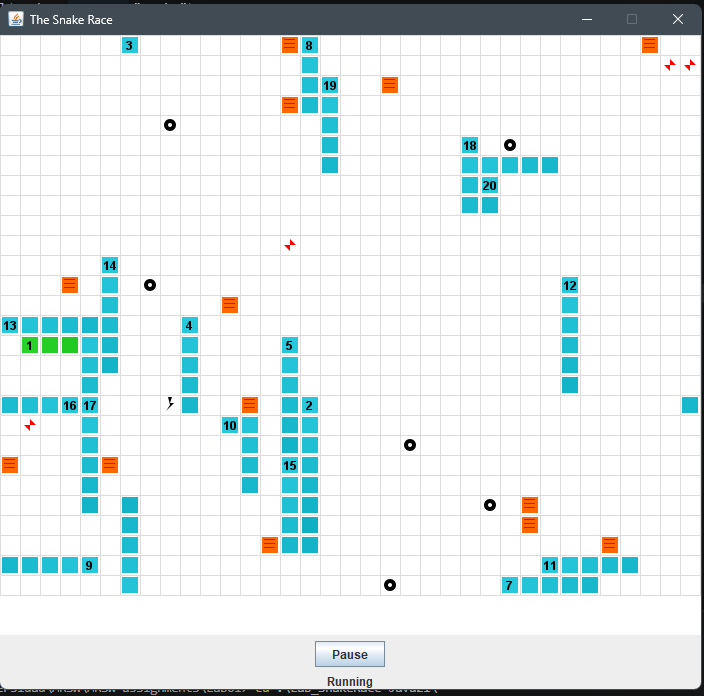

# Snake Race — ARSW Lab #2 (Java 21, Virtual Threads)

**Escuela Colombiana de Ingeniería – Arquitecturas de Software**  
Laboratorio de programación concurrente: condiciones de carrera, sincronización y colecciones seguras.

Repositorio del laboratorio: https://github.com/DECSIS-ECI/Lab_SnakeRace-Java21

---

## Requisitos

- **JDK 21** (Temurin recomendado)
- **Maven 3.9+**
- SO: Windows, macOS o Linux

---

## Cómo ejecutar

```bash
mvn clean verify
mvn -q -DskipTests exec:java -Dsnakes=4
```

- `-Dsnakes=N` → inicia el juego con **N** serpientes (por defecto 2).
- **Controles**:
  - **Flechas**: serpiente **0** (Jugador 1).
  - **WASD**: serpiente **1** (si existe).
  - **Espacio** o botón **Action**: Pausar / Reanudar.

---

## Reglas del juego (resumen)

- **N serpientes** corren de forma autónoma (cada una en su propio hilo).
- **Ratones**: al comer uno, la serpiente **crece** y aparece un **nuevo obstáculo**.
- **Obstáculos**: si la cabeza entra en un obstáculo hay **rebote**.
- **Teletransportadores** (flechas rojas): entrar por uno te **saca por su par**.
- **Rayos (Turbo)**: al pisarlos, la serpiente obtiene **velocidad aumentada** temporal.
- Movimiento con **wrap-around** (el tablero "se repite" en los bordes).

---

## Arquitectura (carpetas)

```
co.eci.snake
├─ app/                 # Bootstrap de la aplicación (Main)
├─ core/                # Dominio: Board, Snake, Direction, Position
├─ core/engine/         # GameClock (ticks, Pausa/Reanudar)
├─ concurrency/         # SnakeRunner (lógica por serpiente con virtual threads)
└─ ui/legacy/           # UI estilo legado (Swing) con grilla y botón Action
```

---

# Actividades del laboratorio

## Parte I — (Calentamiento) `wait/notify` en un programa multi-hilo

Modificamos `PrimeFinder` para que, cada `t` milisegundos, todos los hilos trabajadores se detengan, se muestre cuántos números primos se han encontrado y el programa espere ENTER para reanudar. La solución usa el modelo de monitores de Java sin espera activa.

La coordinación se concentra en `Control` y en un único monitor compartido. Los workers verifican una condición de pausa antes de continuar el procesamiento, mientras que el hilo principal activa y desactiva dicha pausa en intervalos regulares.

### Diseño de sincronización

- **Monitor compartido**: el objeto `monitor` de `Control` es el único lock usado para coordinar la pausa y la reanudación.
- **Estado compartido**: la variable `paused` representa la condición de espera de los trabajadores.
- **Lectura consistente**: `isPaused()` sincroniza sobre `monitor`, por lo que lee `paused` con el mismo lock que usan `wait()` y `notifyAll()`.
- **Espera sin busy-waiting**: los workers ejecutan `while (control.isPaused()) { monitor.wait(); }`, liberando el monitor mientras esperan.
- **Reanudación segura**: el hilo de control pone `paused = false` dentro de `synchronized(monitor)` y luego invoca `monitor.notifyAll()` para despertar a todos los hilos.

### Flujo de ejecución

1. `Control` inicia los hilos trabajadores.
2. Cada `TMILISECONDS`, `Control` activa la pausa con `paused = true`.
3. Se imprime el total de primos encontrados.
4. El programa espera la entrada del usuario con `Scanner.nextLine()`.
5. Al presionar ENTER, `Control` desactiva la pausa y llama a `notifyAll()`.
6. Los workers retoman su ejecución desde el punto en el que quedaron suspendidos.

### Cómo se evitan errores de sincronización

- **Lost wakeups**: se usa un `while` alrededor de `wait()` para revalidar la condición después de cada despertar.
- **Inconsistencia del estado**: la lectura y escritura de `paused` se hacen bajo el mismo monitor.
- **Espera activa**: no se hace polling; los hilos quedan bloqueados dentro de `wait()` hasta que son despertados.


El uso de un único lock compartido y de una condición explícita permite coordinar los hilos de manera segura, clara y sin consumo innecesario de CPU.


---

## Parte II — SnakeRace concurrente (núcleo del laboratorio)

### 1) Análisis de concurrencia

El código da autonomía a cada serpiente usando un `SnakeRunner` por serpiente. Cada runner ejecuta su propio ciclo: decide giros, avanza, reacciona al resultado del movimiento y duerme un tiempo corto antes del siguiente paso. En otras palabras, cada serpiente "piensa" y se mueve por su cuenta; no existe un hilo central que mueva a todas.

Por otro lado el sistema tiene dos caminos concurrentes principales: los hilos de las serpientes, que actualizan el modelo del juego, y la UI, que repinta el tablero y consulta el estado para mostrarlo.
El `GameClock` controla estos repintados y el estado visual de la interfaz, pero no es quien mueve a las serpientes. Por eso, pausar la UI no detiene automáticamente los `SnakeRunner`.

### Posibles condiciones de carrera

- `Board` es compartido por todos los `SnakeRunner`. Sin sincronización, dos hilos podrían intentar modificar al mismo tiempo ratones, obstáculos, teleports o turbo: por ejemplo si dos serpientes se comen al mismo tiempo un raton, ambas intentan añadir un nuevo obstaculo y un nuevo raton y asi alterar estas colecciones. O del mismo modo como el metodo randomEmpty() que no esta protegido y puede ser accedido por multiple hilos.

  Pero por eso `Board.step(...)` está sincronizado, lo cual protege el avance de una serpiente sobre el tablero y evita que dos runners alteren el mismo estado al mismo tiempo. 

- Se usa `snapshot()` para la lectura que usa la UI, lo permite leer el cuerpo para dibujarlo, pero el riesgo aparece si la UI lee mientras otro hilo modifica la serpiente.
- Los metodos `head()` y `advance()` trabajan sobre el mismo estado interno de la serpiente. Si fueran llamados desde varios hilos sin coordinación, podrían producir lecturas inconsistentes o pérdida de actualizaciones.
- El metodo `turn()` modifica la dirección de la serpiente mientras `SnakeRunner` la consulta en cada paso.

### Colecciones o estructuras no seguras en contexto concurrente

- `ArrayDeque` en `Snake.body`.
- `HashSet` en `Board.mice`, `Board.obstacles` y `Board.turbo`.
- `HashMap` en `Board.teleports`.

Estas colecciones no son thread‑safe pero están protegidas parcialmente por sincronización externa.

### Ocurrencias de espera activa (busy-wait) o sincronización innecesaria

No se observa un busy-wait clásico fuerte, porque `SnakeRunner` no entra en un ciclo de consulta constante sin dormir: después de mover una serpiente, hace `Thread.sleep(...)` y no gasta CPU. Tambien puede haber un bloqueo innecesario ya que el metodo step es sincronizado, entonces bloquea todo el board y a las demas serpientes.

Por otro lado el control de ejecución está desacoplado entre la UI y los runners. `GameClock.pause()` solo cambia el estado visual de la interfaz, pero los `SnakeRunner` siguen corriendo. Esto explica por qué al pausar la UI puede seguir avanzando la simulación interna y parece como si se teletransportaran.

### 2) Correcciones mínimas y regiones críticas

- **Elimina** esperas activas reemplazándolas por **señales** / **estados** o mecanismos de la librería de concurrencia.

Para eliminar las esperas activas, vamos a usar un `PauseController` que maneje un estado compartido de pausa y reanudación. La solución usa el modelo de monitores de Java (`synchronized`, `wait()` y `notifyAll()`) para bloquear y reanudar a los `SnakeRunner` sin hacer polling activo. Así evitamos consumir CPU innecesariamente y coordinamos la suspensión y la reanudación de forma segura.

- Protege **solo** las **regiones críticas estrictamente necesarias** (evita bloqueos amplios).

Aquí se dejan únicamente las secciones que modifican el estado compartido; no se sincronizan variables locales ni cálculos que no comparten memoria. El acceso a `Board` debe ser atómico porque es un recurso global compartido, mientras que la UI no debe bloquear todo el juego y por eso lee copias defensivas del tablero.

En el caso de `Snake.snapshot()`, la idea es la misma: la UI trabaja sobre una copia del cuerpo para dibujar, pero si se quiere una consistencia total entre lectura y escritura, esa copia también debería coordinarse con sincronización adicional.

Por esa razón `step(...)` sí debe ser `synchronized`, ya que ahí se lee y modifica el estado compartido del tablero. En cambio `randomEmpty()` no necesita sincronización adicional en este diseño, porque solo se invoca desde `step(...)` y desde el constructor, y en ambos casos ya está cubierto por el contexto de uso: `step(...)` entra dentro del lock de `Board`, y el constructor se ejecuta antes de que el objeto sea compartido con otros hilos.

El método `createTeleportPairs(...)` también se usa únicamente durante la construcción del tablero, así que hoy tampoco necesita un bloqueo adicional. Si en el futuro se llama desde otros hilos o desde otro contexto fuera del constructor, entonces sí habría que revisar su sincronización.

Justificamos cada cambio indicando el riesgo y la solución aplicada: si una región crítica compartía estado mutable, podía producir inconsistencias o carreras; por eso se protegió solo el acceso que realmente modifica el estado compartido y se dejaron fuera las variables locales y los cálculos que no comparten memoria.

### 3) Control de ejecución seguro (UI)

Se implementó el ciclo completo de ejecución con **Start / Pause / Resume** usando el botón **Action**, el `GameClock` y un `PauseController` compartido por todos los `SnakeRunner`.



Cuando el usuario pulsa **Pause**, la UI no calcula el resumen inmediatamente. Primero cambia el estado a _"Waiting for a stable pause state..."_ y luego espera una **pausa estable**: esto significa que todos los runners activos ya llegaron al punto de espera (`wait`) y ninguno está aplicando un `step(...)` sobre el tablero.




Solo cuando esa condición se cumple, la UI arma y publica el resumen:

- **Serpiente viva más larga**: la serpiente con `isAlive() == true` y mayor longitud (`snapshot().size()`).
- **Peor serpiente**: la que murió primero, usando un orden de muerte incremental asignado en `Board.killSnake(...)`.



Con esta estrategia se evita el _tearing_ de estado al pausar, porque el resumen no se calcula en medio de un avance parcial.


### 4) Robustez bajo carga

Al ejecutar el juego con un número alto de serpientes (por ejemplo, N = 20), no se presentan condiciones de carrera visibles ni problemas de estabilidad. Esto se debe a que las modificaciones sobre el estado compartido del tablero se realizan dentro de regiones críticas sincronizadas, evitando accesos concurrentes inseguros a las colecciones compartidas.




---

## Entregables

1. **Código fuente** funcionando en **Java 21**.
2. Todo de manera clara en **`**el reporte de laboratorio**`** con:
   - Data races encontradas y su solución.
   - Colecciones mal usadas y cómo se protegieron (o sustituyeron).
   - Esperas activas eliminadas y mecanismo utilizado.
   - Regiones críticas definidas y justificación de su **alcance mínimo**.
3. UI con **Iniciar / Pausar / Reanudar** y estadísticas solicitadas al pausar.

---

## Criterios de evaluación (10)

- (3) **Concurrencia correcta**: sin data races; sincronización bien localizada.
- (2) **Pausa/Reanudar**: consistencia visual y de estado.
- (2) **Robustez**: corre **con N alto** y sin excepciones de concurrencia.
- (1.5) **Calidad**: estructura clara, nombres, comentarios; sin _code smells_ obvios.
- (1.5) **Documentación**: **`reporte de laboratorio`** claro, reproducible;

---

## Tips y configuración útil

- **Número de serpientes**: `-Dsnakes=N` al ejecutar.
- **Tamaño del tablero**: cambiar el constructor `new Board(width, height)`.
- **Teleports / Turbo**: editar `Board.java` (métodos de inicialización y reglas en `step(...)`).
- **Velocidad**: ajustar `GameClock` (tick) o el `sleep` del `SnakeRunner` (incluye modo turbo).

---

## Cómo correr pruebas

```bash
mvn clean verify
```

Incluye compilación y ejecución de pruebas JUnit. Si tienes análisis estático, ejecútalo en `verify` o `site` según tu `pom.xml`.

---

## Créditos

Este laboratorio es una adaptación modernizada del ejercicio **SnakeRace** de ARSW. El enunciado de actividades se conserva para mantener los objetivos pedagógicos del curso.

**Base construida por el Ing. Javier Toquica.**
