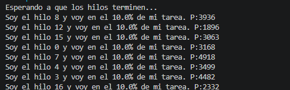
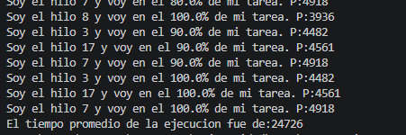

# Taller de Sincronización - Patrón de Sincronización por Barrera

**Institución:** Escuela Colombiana de Ingeniería
**Asignatura:** Arquitecturas de Software
**Tema:** Patrón de Sincronización por Barrera

---

## Objetivo

Implementar una estrategia de sincronización por barrera para coordinar la ejecución de múltiples hilos, garantizando que el cálculo del tiempo promedio de ejecución se realice únicamente cuando todos los hilos hayan finalizado su trabajo.

---

## Instrucciones

### 1. Importar el proyecto

Descargue e importe el proyecto:

* `BarrierSyncProblem.zip`

---

### 2. Analizar el comportamiento inicial

Revise el programa principal.

El ejemplo utiliza **N hilos** que ejecutan una misma tarea, pero cada uno lo hace a una velocidad diferente. El objetivo es ejecutar todos los hilos y, una vez finalicen, calcular el promedio de sus tiempos de ejecución.

#### Actividad

1. Ejecute el programa.
2. Observe el mensaje:

```text
El tiempo promedio de la ejecución fue de ...
```

3. Responda las siguientes preguntas:

* ¿Cuál fue el resultado obtenido?
* ¿Es correcto el valor mostrado?
* ¿Por qué se produce dicho resultado?

Al ejecutar el programa se observa que los hilos comienzan a ejecutar sus tareas y muestran periódicamente el porcentaje de avance. Sin embargo, el mensaje de El tiempo promedio es 0. Esto aparece inmediatamente después de iniciar los hilos, antes de que estos finalicen su trabajo.

Se obtuvo un tiempo promedio de ejecución incorrecto, de 0. Este valor mostrado no representa el tiempo real de ejecución de los hilos, ya que estos continúan trabajando después de que el promedio ha sido calculado e impreso.

Esto debido a que el hilo principal crea e inicia los hilos trabajadores mediante start(), pero no espera a que estos finalicen antes de calcular el promedio. Como consecuencia, cuando se ejecuta la seccion de obtener el resultado, la mayoría de los hilos aún no han terminado su método run(), por lo que el atributo resultado conserva su valor inicial (0). Esto provoca que el promedio se calcule utilizando datos incompletos, generando un resultado incorrecto.




---

### 3. Implementar sincronización por barrera

Aplique una estrategia de sincronización por barrera que garantice que el cálculo del promedio de los tiempos de ejecución se realice únicamente cuando el último hilo haya terminado su trabajo.

#### Requerimientos

* El programa principal debe permanecer bloqueado mientras los hilos se encuentran en ejecución.
* El programa principal debe continuar únicamente cuando todos los hilos hayan finalizado.
* El cálculo del promedio debe ejecutarse después de que el último hilo complete su tarea.


Se implementó una barrera utilizando CountDownLatch. El hilo principal permanece bloqueado mediante await() mientras los hilos trabajadores ejecutan sus tareas. Cada hilo decrementa el contador de la barrera mediante countDown() al finalizar. Cuando el último hilo termina, el contador llega a cero y el hilo principal continúa su ejecución para calcular el tiempo promedio.


---

### 4. Verificación

Ejecute nuevamente el programa y verifique que:

* Todos los hilos terminan antes de calcular el promedio.
* El programa principal espera correctamente la finalización de todos los hilos.
* El valor promedio calculado corresponde a los tiempos reales de ejecución.





---

## Resultado Esperado

Después de implementar la sincronización por barrera:

* No deben existir cálculos prematuros del promedio.
* El hilo principal debe esperar la terminación de todos los hilos trabajadores.
* El promedio mostrado debe reflejar correctamente los tiempos de ejecución registrados por cada hilo.
